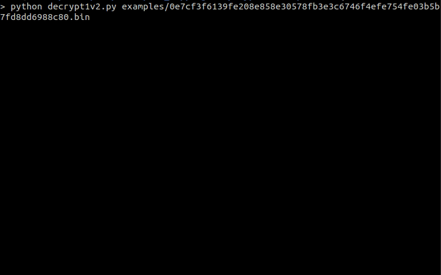

de-CryptOne v.2
==============

Is a python 3 script which unpacks statically x86 samples packed with CryptOne packer versions from ~2021/04 until now (2022/01).

### Usage

```
~$ python3 decrypt1v2.py sample.bin
```

&nbsp;
#### Example



&nbsp;
#### Requirements (Latest tested)

* Yara, Version 3.9.0
* yara-python, Version 4.1.0
* pefile, Version 2021.5.24

&nbsp;
### Support

In case some files are not working, please make sure it is packed with CryptOne, if yes please provide me the hash in a DM ([@Tera0017](https://twitter.com/tera0017)).

Also, if you managed to obtain a x64 sample please send me over to add support.

[Enjoy](https://www.youtube.com/watch?v=5I3fI_Ezk5I) while unpacking ;)
